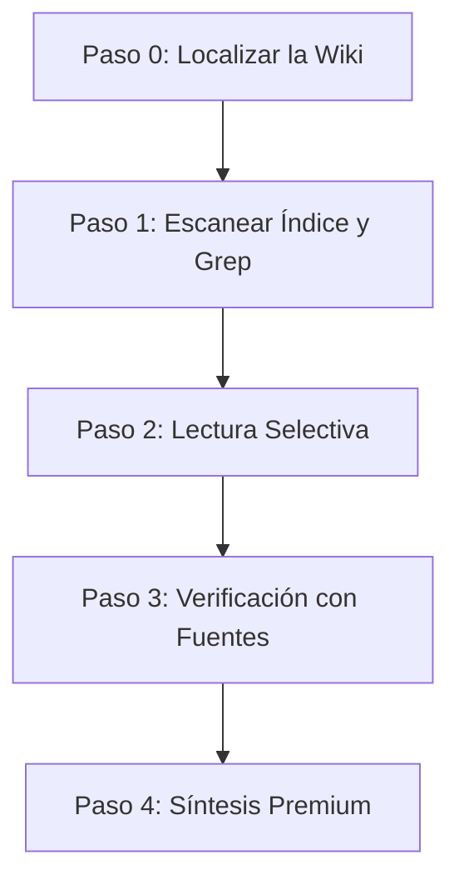

# Wiki Query para Antigravity

Este skill implementa la operación **QUERY** (consulta avanzada y síntesis) bajo el patrón **LLM Wiki**. Permite navegar y extraer conocimiento interconectado de tu vault de Obsidian de manera ultraeficiente, precisa y directa, maximizando el uso de enlaces conceptuales (`[[wikilinks]]`) y evitando lecturas innecesarias de archivos irrelevantes.

---

## Flujo de Trabajo en Antigravity

El proceso consta de 5 pasos optimizados para las herramientas de Antigravity:

### Paso 0 — Localizar y Validar la Wiki

Antes de buscar, debes confirmar la estructura del vault activo:
1. **Buscar el índice**: Intenta abrir `wiki/index.md` usando la herramienta `view_file`.
2. **Fallback a la raíz**: Si no se encuentra, utiliza `list_dir` en el directorio de trabajo para ver si la carpeta tiene un nombre diferente (por ejemplo, `knowledge-base/` o `notas/`), o busca un archivo `CLAUDE.md` que indique dónde está la wiki.
3. **Sin wiki detectada**: Si no hay ninguna estructura de wiki válida, responde de manera amigable:
   > No encuentro una wiki estructurada en este directorio. ¿Te gustaría que cree una nueva utilizando la skill **wikiforge**?

---

### Paso 1 — Escanear el Índice y Búsqueda Dirigida

El archivo `wiki/index.md` es el mapa maestro. En lugar de leer a ciegas, sigue esta estrategia combinada:

- **Estrategia A (Lectura del Índice)**: Lee `wiki/index.md` con `view_file` para obtener una visión general rápida de las categorías, las páginas disponibles y sus descripciones de una línea.
- **Estrategia B (Búsqueda Vectorial/Keyword)**: Si la wiki es grande o necesitas un término muy específico, usa `grep_search` con `SearchPath` apuntando a `wiki/` para localizar menciones exactas.
- **Selección**: Identifica entre **1 y 3 páginas** que respondan directamente a la intención del usuario.

---

### Paso 2 — Lectura Selectiva e Identificación de Relaciones

Una vez identificadas las páginas objetivo:
1. Abre las páginas utilizando `view_file`.
2. Analiza los tres componentes clave de cada página:
   - **Frontmatter YAML**: Examina las etiquetas (`tags`), el `tipo` de entidad y las `fuentes` originales para validar la relevancia.
   - **Contenido y Ejemplos**: Extrae explicaciones conceptuales y fragmentos prácticos/citas textuales.
   - **Wikilinks** (`[[nombre-pagina]]`): Identifica qué otras páginas están conectadas. Si una página referenciada parece crucial para dar una respuesta completa, ábrela también (máximo 1 nivel de profundidad adicional para evitar la "parálisis por análisis").

---

### Paso 3 — Verificación y Puentes con Fuentes Originales (`raw/`)

La carpeta `fuentes/` contiene fichas resumen de cada material, mientras que `raw/` almacena los documentos, transcripciones o artículos originales.

Solo debes acudir a las fuentes originales en `raw/` cuando:
- El usuario solicite explícitamente una **cita textual exacta o transcripción literal**.
- La página conceptual de la wiki no tenga suficiente nivel de detalle.
- Necesites resolver una discrepancia conceptual o validar datos numéricos y métricas críticas.

> [!TIP]
> Consulta primero la página resumen correspondiente en `wiki/fuentes/` antes de abrir el archivo original completo en `raw/`, ya que esto suele ahorrar mucho contexto.

---

### Paso 4 — Síntesis y Formato Premium de Respuesta

Al responder al usuario, tu diseño visual y estructura deben ser impecables, siguiendo los estándares de excelencia de Antigravity:

1. **Estructura y Títulos**: Usa una jerarquía clara de encabezados (`#`, `##`, `###`).
2. **Respuestas Interconectadas**: Utiliza el formato `[[nombre-pagina]]` o `[[nombre-pagina|texto personalizado]]` directamente en la redacción cuando menciones conceptos o entidades que existan en la wiki.
3. **Citas y Evidencias**: Utiliza bloques de cita (`>`) para resaltar ejemplos, datos empíricos o testimonios extraídos de las notas.
4. **Notas de Enlace e Idioma**: Mantén el idioma del vault de forma consistente (si está en español, responde en español y mantén la terminología).
5. **Sección de Fuentes**: Al final del mensaje, incluye siempre una sección limpia de referencias:
   > **Fuentes de la Wiki:** [[nombre-pagina-1]], [[nombre-pagina-2]]

---

## Mapeo de Herramientas en Antigravity

Para ejecutar este skill con precisión, utiliza las herramientas nativas de la siguiente manera:

| Acción | Herramienta | Parámetros recomendados / Uso |
|---|---|---|
| **Escanear Índice** | `view_file` | `AbsolutePath: "[Cwd]/wiki/index.md"` |
| **Búsqueda Rápida** | `grep_search` | `SearchPath: "[Cwd]/wiki"`, `Query: "término"`, `CaseInsensitive: true` |
| **Leer Páginas** | `view_file` | `AbsolutePath: "[Cwd]/wiki/categoria/pagina.md"` |
| **Comprobar Estructura** | `list_dir` | `DirectoryPath: "[Cwd]"` |

---

## Lo que NO debes hacer (Anti-patrones)

- ❌ **No ignores el índice**: Hacer una búsqueda general con `grep` sin mirar el índice a menudo te hará perder el contexto estructurado de la wiki.
- ❌ **No leas en exceso**: Evita abrir más de 5 archivos en una sola consulta a menos que sea estrictamente necesario para consolidar la información.
- ❌ **No inventes información**: Si un concepto no se encuentra en la wiki, indícalo claramente: *"Este concepto no está documentado actualmente en la wiki. ¿Quieres que lo investigue o que prepare una página para ingestar con **wikiforge**?"*.
- ❌ **No rompas el estilo**: Asegúrate de que las citas y referencias mantengan el formato Obsidian `[[wikilink]]` nativo para facilitar la navegación en el vault del usuario.